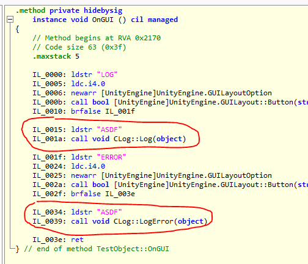
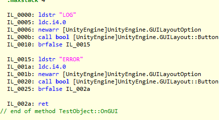
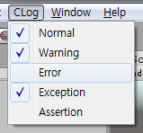

Unity.CLog
====
conditional logger

```
아래에 주절주절 쓴 글이 실제 코드보다 더 김
```

외 필요한가
----
유니티에서의 일반적인 로깅은 아래와 같은 형태를 가집니다.
```cs
Debug.Log("Player Level : " + player.level.ToString());
```
위 코드는 컴파일 될 경우 아래와 같은 바이트코드로 변환됩니다.
```MSIL
ldstr "Player Level : "
ldloc.0
ldflda int32 TestObject/Player::level
call instance string [mscorlib]System.Int32::ToString()
call string [mscorlib]System.String::Concat(string, string)
call void [UnityEngine]UnityEngine.Debug::Log(object)
```

좀 더 발전된 형태의 로깅 클래스는 로그 레벨에 따라서 로그를 ON/OFF 시켜서 원치 않는 로그는 출력되지 않도록 할 수 있지만, 
로그가 출력되지 않는 경우에도 여전히 `"Player Level : " + player.level.ToString()` 의 코드가 실행되는것은 피할 수 없습니다. (불필요한 스트링 concat 연산이 일어남)

CLog 를 사용하면
----
__로그가 켜짐 상태일 때__<br>
실제로 스트링을 로드하고, 로그 메소드를 호출합니다.
<br>

__로그가 꺼짐 상태일 때__<br>
로그 메소드를 호출하지 않는 것 뿐만 아니라, 스트링조차도 로드하지 않습니다.
<br>


사용방법
----

